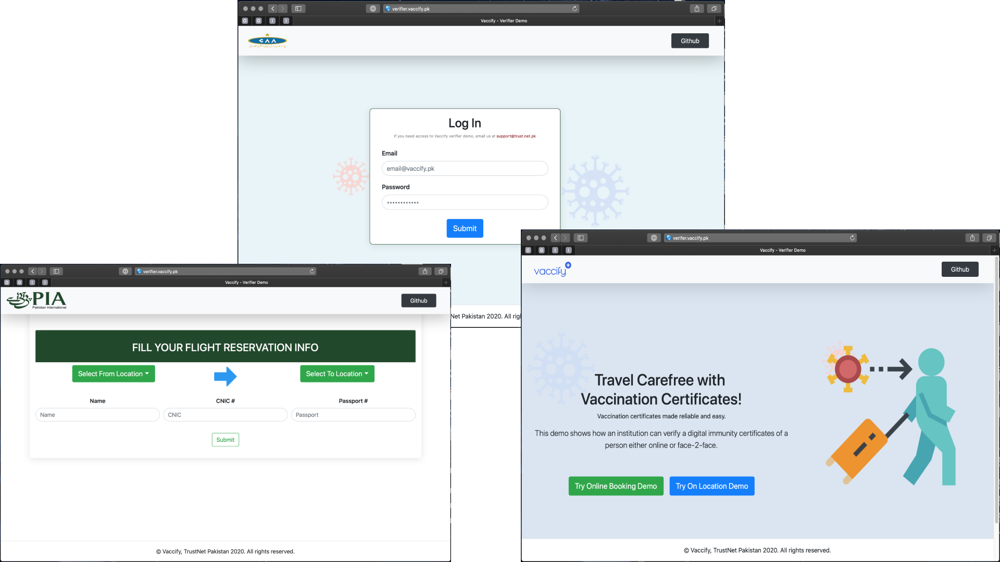

# COV-ID Verifier Application
A front-end web application to verify COVID-19 vaccination digital verifiable credential.

# Screenshots



# How to run
```
git clone https://github.com/TrustNetPK/cov-id-verifier.git
cd cov-id-verifier-demo
npm install
npm start
```

In case the above steps do not start the app, try running below commands in specific order:
```
Press Ctrl + C to stop the app
npm build
npm install -g serve
serve -s build
```
Navigate to `http://localhost:3000` on your browser

# License
<a rel="license" href="http://creativecommons.org/licenses/by-nc-sa/4.0/"></a><br />This work is licensed under a <a rel="license" href="http://creativecommons.org/licenses/by-nc-sa/4.0/">Creative Commons Attribution-NonCommercial-ShareAlike 4.0 International License</a> by TrustNet Pakistan.
